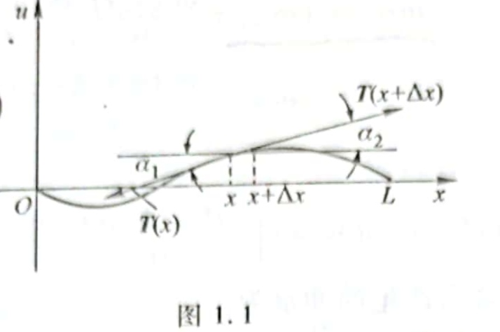

# 弦振动方程的样式

$$u_{tt}=a^2u_{xx}+f(x,t)$$

更高维的为

$$u_{tt}=a^2(u_{xx}+u_{yy}+u_{zz})+f(x,y,z,t)$$

> Laplace算子与Gradient算子(梯度算子)
> 梯度算子是全部一阶偏导组成的向量，即梯度向量，表示为$$\nabla f=(\frac{\partial f}{\partial x},\frac{\partial f}{\partial x},\frac{\partial f}{\partial x})^T$$
>
> 拉普拉斯算子是二阶微分算子，用来衡量一个场中的弯曲程度，表示为$$\Delta f=\frac{\partial^2 f}{\partial x^2}+\frac{\partial^2 f}{\partial y^2}+\frac{\partial^2 f}{\partial z^2}$$
> 

# 弦振动方程的导出

## 基本假设
1. 将弦视为曲线，线密度$\rho$视为常数
2. 弦只做微小横振动，质点仅垂直运动
3. 弦各点张力方向与弦切线方向一致；弦的伸长与张力的关系服从胡克定律

## 推导

张力表示为$T(x,t)$

### 1. 张力与时间无关

任取$[x, x+\Delta x]$这一段上的弧，其弧长为$$\Delta s=\int_x^{x+\Delta x}\sqrt{1+(\frac{\partial u}{\partial x})^2}\text{d}x$$

> 弧长公式的来历：
> 对曲线$F(x,y)=0$，根据勾股定理有$\text{d}s^2=\text{d}x^2+\text{d}y^2$，那么就有$$s|_{x=0}^M=\int_x^{x+\Delta x}\sqrt{1+(\frac{\partial y}{\partial x})^2}\text{d}x$$

**$(\frac{\partial u}{\partial x})^2$是关于$u_x$的高阶小量**，由假设，$u_x$小，因此$(\frac{\partial u}{\partial x})^2$小。

> 对误差的证明：
> $$\sqrt{1+u_x^2}-1=\frac{u_x^2}{\sqrt{1+u_x^2}+1}\leq \frac{1}{2}u_x^2=\text{o}(u_x)$$

这样就有

$$\Delta s \approx \Delta x$$

也就是说弦振动中没伸长。

由于假设中张力来自于伸长，振动中不伸长即代表张力与时间无关$T(x,t)=T(x)$。

### 2. 张力与位置无关

由于假设中，各个质点仅垂直运动，因此段$[x, x+\Delta x]$也垂直动。那就要求这一段整体沿$x$轴合力为$0$。

于是有$$T(x)\cos{\alpha_1}=T(x+\Delta x)\cos{\alpha_2}$$

弦仅做微小振动，那么有$$\cos{\alpha_1}=\cos{\alpha_2}=1$$

> 对误差的证明
> 由$\tan{\alpha_1}=u_x$
> $\cos{\alpha_1}-1=\frac{1}{\sec{\alpha_1}}-1=\frac{1}{\sqrt{1+\tan^2{\alpha_1}}}-1=\frac{1-\sqrt{1+u_x^2}}{\sqrt{1+u_x^2}}\leq 1-\sqrt{1+u_x^2}=\text{o}(u_x)$

因此有$T(x)=T(x+\Delta x)$。

由任意性，张力与位置无关。

**张力是一个常数**。

### 3. 不受外力时的波动方程

根据$\sin \alpha \approx \tan \alpha=u_x$的估计，就有垂直方向的合力

$$T\sin{\alpha_1}-T\sin{\alpha_2}=Tu_x|_x^{x+\Delta x}$$

现在考虑时间$[t,t+\Delta t]$小区间。

时间$t$时小段的动量为$$\int_x^{x+\Delta x}\rho u_t(x,t)\text{d}x$$

因此这一段时间内的动量增加量为$$\int_x^{x+\Delta x}\rho (u_t(x+\Delta x,t)-u_t(x,t))\text{d}x$$

而这段时间的冲量为$$\int_t^{t+\Delta t}T(u_x(x+\Delta,t)-u_x(x,t))\text{d}t$$

动量与冲量相等，有

$$\int_x^{x+\Delta x}\rho (u_t(x+\Delta x,t)-u_t(x,t))\text{d}x=\int_t^{t+\Delta t}T(u_x(x+\Delta,t)-u_x(x,t))\text{d}t$$

由牛顿-莱布尼兹公式，也就有$$\int_t^{t+\Delta t}\int_x^{x+\Delta x}Tu_{xx}(x,t)-\rho u_{tt}(x,t)\text{d}x\text{d}t=0$$

然而，这些小区间都是任意的，由任意性就有$$u_{tt}-au_{xx}=0$$，这是弦不受外力的方程。

其中$a=\frac{T}{\rho}$

### 4. 受外力时的波动方程

若$t$时刻力的线密度为$F(x,t)$，方向垂直与$x$轴，则小段受该力的冲量为$$\int_t^{t+\Delta t}\int_x^{x+\Delta x}F(x,t)\text{d}x\text{d}t$$

也就是$$\int_t^{t+\Delta t}\int_x^{x+\Delta x}Tu_{xx}(x,t)-\rho u_{tt}(x,t)+F(x,t)\text{d}x\text{d}t=0$$

由任意性，有$$u_{tt}-au_{xx}=f(x,t)$$

其中，$f(x,t)=\frac{F(x,t)}{\rho} $

> 这样的求解方法，实际上就是通过找到动量与冲量的两个对偶的性质。动量关于$t$保守，冲量关于$x$保守。将保守的相减改写为导数的积分，并直接对不保守的积分。

# 定解条件

弦两端的条件被称为**边界条件**，初始时刻的条件被称为**初始条件**，边界条件与初始条件统称**定解条件**。

## 边界条件

### 第一类边界条件 (Dirichlet边界条件)

第一类是一端**被固定**的边界条件。

$$u(0,t)=0,u(l,t)=0$$

### 第二类边界条件 (Neumann边界条件)

第二类是弦的一端**自由，未受垂直方向外力**的情况。

假设是$x=0$处被固定

$$u_x(0,t)=0$$

更普遍的形式是

$$u_x(0,t)=\mu(t)$$

### 第三类边界条件 

第三类是边界一端**固定在弹性支撑上**。那么支撑对弦有一个拉力。设支撑劲度系数为$k$。

假设还是$x=0$处被固定，如果支撑总是抵消弦的拉力，就有

$$u_x(0,t)+\sigma u(0,t)=0$$

更一般的是

$$u_x(0,t)+\sigma u(0,t)=v(t)$$

其中$\sigma=\frac{k}{T}$，这通常意味着第三类边界条件中，这个系数$\sigma$是常数且为正。

