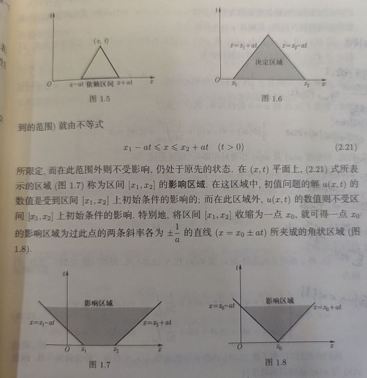
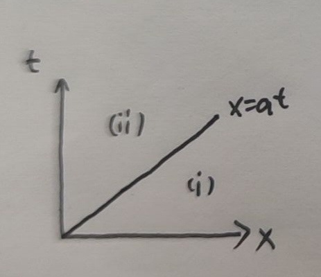
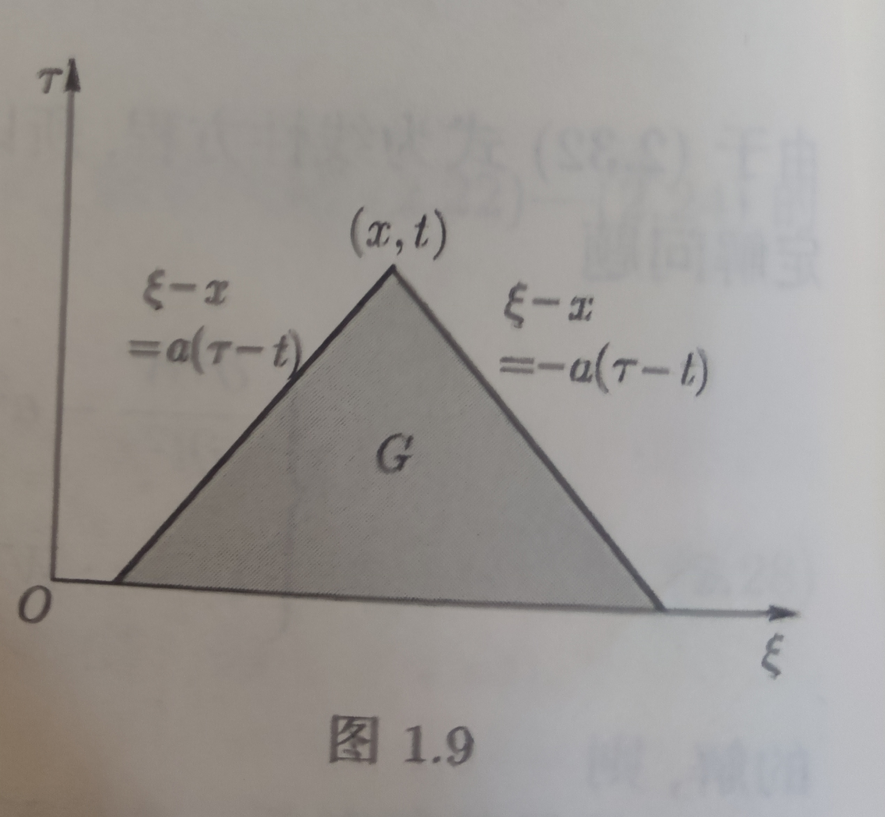

# 叠加原理

对弦振动方程$$u_{tt}-a^2u_{xx}=f(x,t)$$，其满足叠加原理，因此有

若$u_1$满足$$u_{tt}-a^2u_{xx}=f_1(x,t)$$，$u_2$满足$$u_{tt}-a^2u_{xx}=f_2(x,t)$$，则可以线性叠加，有$C_1u_1+C_2u_2$满足$$u_{tt}-a^2u_{xx}=C_1f_1(x,t)+C_2f_2(x,t)$$

# 弦振动方程的达朗贝尔解法

对于最简单的情形，不含边界影响

$$\begin{equation}
\nonumber
\left\{
    \begin{array}{ll}
        u_{tt}-a^2u_{xx}=f(x,t)\\
        t=0:u=\phi(x),u_t=\psi(x)
    \end{array}
\right.
\end{equation}$$

像这样，定解条件只有初始条件的，成为**Cauchy问题**。

如果有初值及边值，就是初边值问题，或称混合问题。

$f\equiv0$称为自由振动，否则称为强迫振动。

## Cauchy 问题应用叠加原理

Cauchy问题可以归结为

$u_1$为$$\begin{equation}
\left\{
    \begin{array}{ll}
        u_{tt}-a^2u_{xx}=0\\
        t=0:u=\phi(x),u_t=\psi(x)
    \end{array}
\right.
\end{equation}$$的解，$u_2$是$$\begin{equation}
\left\{
    \begin{array}{ll}
        u_{tt}-a^2u_{xx}=f(x,t)\\
        t=0:u=0,u_t=0
    \end{array}
\right.
\end{equation}$$的解，那么Cauchy问题的解为$$u=u_1+u_2$$

## Part1, 齐次方程带非齐次初值条件

这一部分先解决$$\begin{equation}
\nonumber
\left\{
    \begin{array}{ll}
        u_{tt}-a^2u_{xx}=0\\
        t=0:u=\phi(x),u_t=\psi(x)
    \end{array}
\right.
\end{equation}$$

### 求齐次方程的通解

通过自变量变换的方法求解。引入$$\xi=x-at,\eta=x+at$$，变换有$$u_{\xi\eta}=0$$，对其积分有$$u(\xi,\eta)=F(\xi)+G(\eta) $$，于是有$$u=F(x-at)+G(x+at) $$，这是所求齐次微分方程的通解。

在这里，$F$和$G$可以看作向不同方向传播的波。这样，该定解问题被转化为了右传播波与左传播波相叠加。这种方法称为传播波法。

### 求非齐次初值条件下的特解·达朗贝尔公式

代入初值条件可以有$$F(x)+G(x)=\phi(x) $$$$a[-F'(x)+G'(x)]=\psi(x) $$，可以求解出来$$\begin{equation}
    \nonumber
    \left\{
        \begin{array}{ll}
            F(x)=\frac{1}{2}\phi(x)-\frac{1}{2a}\int_{x_0}^{x}\psi(\alpha)\text{d}\alpha+\frac{C}{2a}\\
            G(x)=\frac{1}{2}\phi(x)+\frac{1}{2a}\int_{x_0}^{x}\psi(\alpha)\text{d}\alpha-\frac{C}{2a}
        \end{array}
    \right.
\end{equation}$$，因此有最后的特解$$u(x,t)=\frac{\phi(x-at)+\phi(x+at)}{2}+\frac{1}{2a}\int_{x-at}^{x+at}\psi(\alpha)\text{d}\alpha $$，这样的解称为**达朗贝尔公式**。

## 依赖区间、决定区域、影响区域与特征线

### 依赖区间

点$(x,t)$的值依赖区间如图1.5。这代表它的值依由区间中的点的值唯一确定，与区间外的值完全无关。

它是过点分别作斜率为$\pm \frac{1}{a}$的曲线然后在$x$轴上相交得到的区间。这是一个一维区间。

### 决定区域

如图1.6，对轴上任一区间$[x_1,x_2]$作$x=x_1+at,x=x_2-at$，这个区域中任一点的依赖区间都落在区域内。这就称为**决定区域**。

### 影响区域

如图1.7, 1.8，对一个区间或者一个点，作$x=x_1-at,x=x_2+at$就能得到一个影响区域，是这个区间或点能够影响到的区域。

### 特征线

$$x=x_0\pm at$$称为波动方程的**特征线**，扰动实际上沿特征线传播。扰动以有限速度传播是弦振动方程的一个重要特点。

### 半无界弦的自由振动问题

$$\begin{equation}
\nonumber
\left\{
    \begin{array}{ll}
        u_{tt}-a^2u_{xx}=0;t>0,0<x<\infty\\
        t=0:u=\phi(x),u_t=\psi(x);0\leq x<\infty\\
        x=0:u=0;t\geq 0
    \end{array}
\right.
\end{equation}$$

#### 法一：传播波法

希望将函数$\phi,\psi$延拓，使得仍然能满足$x=0$处恒为$0$。

首先记延拓后的函数为$\Phi,\Psi$，由达朗贝尔公式，就有$$U(x,t)=\frac{\Phi(x-at)+\Psi(x+at)}{2}+\frac{1}{2a}\int_{x-at}^{x+at}\Psi(\alpha)\text{d}\alpha $$

要使解出来的$U$在$x=0$处恒为0，就需要$$\frac{\phi(-at)+\psi(at)}{2}+\frac{1}{2a}\int_{-at}^{at}\psi(\alpha)\text{d}\alpha =0$$

由于并不需要所有的延拓可能，而是只需要一个满足的延拓。观察可以发现只要延拓是奇函数就可以。因此做奇延拓。

那么解就是
$$\begin{equation}
\nonumber
u=
\left\{
    \begin{array}{ll}
        \frac{\phi(x-at)+\phi(x+at)}{2}+\frac{1}{2a}\int_{x-at}^{x+at}\psi(\alpha)\text{d}\alpha, x\geq at\\
        \frac{\phi(at-x)+\phi(x+at)}{2}+\frac{1}{2a}\int_{at-x}^{x+at}\psi(\alpha)\text{d}\alpha, 0\leq x < at
    \end{array}
\right.
\end{equation}$$

#### 法二：特征线法：

根据这个将区域分为两部分，(i)与(ii)。

(i)区所有点的依赖区间都在区间内，因此直接用达朗贝尔公式$$u(x,t)=\frac{\phi(x-at)+\phi(x+at)}{2}+\frac{1}{2a}\int_{x-at}^{x+at}\psi(\alpha)\text{d}\alpha, x\geq at$$

(ii)区不行，因此先取方程通解的形式$$u(x,t)=F(x-at)+G(x+at) $$，由$u|_{x=0}=0$，因此$$F(-at)=G(at),\forall t\geq 0 $$，也就有$$F(\tau)=-G(-\tau) $$，从而$$u(x,t)=F(x-at)-F(-x-at) $$

考虑到解的连续性，因此两个区域上的解在$x=at$线上是连续的，因此有$$F(0)-F(-2x)=\frac{\phi(0)+\phi(2x)}{2}+\frac{1}{2a}\int_0^{2x}\phi(\xi)\text{d}\xi $$

那么将$-2x$换成$x$然后代入就有$$u(x,t)=\frac{\phi(at+x)+\phi(at-x)}{2}+\frac{1}{2a}\int_{-x-at}^{x-at}\psi(\xi)\text{d}\xi $$

#### 相容性条件

由于$\phi=u|_{t=0},\psi=u_t|_{t=0} $，由于$u|_{x=0}=0$，因此$\phi(0)=0$。

$\phi''=u_{xx}|_{t=0} $，根据方程知$\phi''=\frac{u_{tt}}{a}|_{t=0} $，又有$\psi=u_t|_{t=0} $，而$x=0$时$u=0$，因此$u_t|_{x=0}=u_{tt}|_{x=0}=0 $，故$\phi''(0)=0,\psi(0)=0 $

## Part2, 带齐次初值条件的非齐次方程应用齐次化原理

$$\begin{equation}
\nonumber
\left\{
    \begin{array}{ll}
        u_{tt}-a^2u_{xx}=f(x,t)\\
        t=0:u=0,u_t=0
    \end{array}
\right.
\end{equation}$$

这个问题是一个初值条件齐次的非齐次方程。

有办法将其化为齐次方程。

求解问题

$$\begin{equation}
\nonumber
\left\{
    \begin{array}{ll}
        w_{tt}-a^2w_{xx}=0;t>\tau\\
        t=\tau:w=0,w_t=f(x,\tau)
    \end{array}
\right.
\end{equation}$$

作代换$\tilde{t}=t-\tau$，然后直接就可以应用达朗贝尔公式了。解得有$$w(x,t,\tau)=\frac{1}{2a}\int_{x-a(t-\tau)}^{x+a(t-\tau)}f(\xi,\tau)\text{d}\xi $$

不证明地直接引入，实际上$$u(x,t)=\int_0^tw(x,t,\tau)\text{d}\tau $$，这就是**齐次化原理(Duhamel定理)**。

实际上$u$的解是$f$在一个三角形区域中的面积分$$u =\iint_G f(\xi,\tau)\text{d}\xi\text{d}\tau $$，也就是决定区域的积分。

# 径向坐标函数

径向坐标函数指的是只要在以原点为中心的同一个球面上，两点的函数值就相等的函数。

$$\forall z_1,z_2 \in R^n,|z_1|=|z_2|=r,\text{then}\\ u(z_1)=u(z_2)  $$

这使得径向坐标函数在球坐标系下的表示十分简单，其实际上只与$r$有关。

那么容易使用链式法则证明这样的定理

> 只要$u$为径向坐标函数，那么$$\Delta u=u_{rr}+\frac{n-1}{r}u_r $$
>
> 该定理将偏微分问题转化为了一个常微分问题。
>
> 务必记住这个定理

实际上，球面波就是这样的函数。

## 例题

求$$u_{tt}-a^2(u_{xx}+u_{yy}+u_{zz})=0 $$的球面波解。

解：

令$$r=\sqrt{x^2+y^2+z^2}$$，那么就有$$u_{tt}-a^2(u_{rr}+\frac{n-1}{r}u_r)=0 $$

令$v=ru$，那么有$$v_{tt}=ru_{tt}\\v_r=ru_r+u\\v_{rr}=ru_{rr}+2u_r $$于是有$$v_{tt}-a^2v_{rr}=0 $$

那么应用达朗贝尔公式就有$$u=\frac{F(r-at)+G(r+at)}{r} $$

