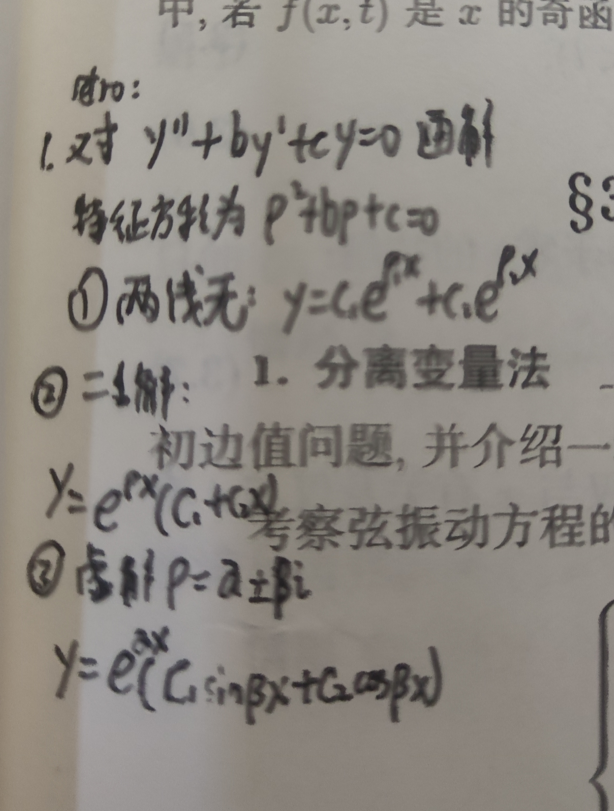
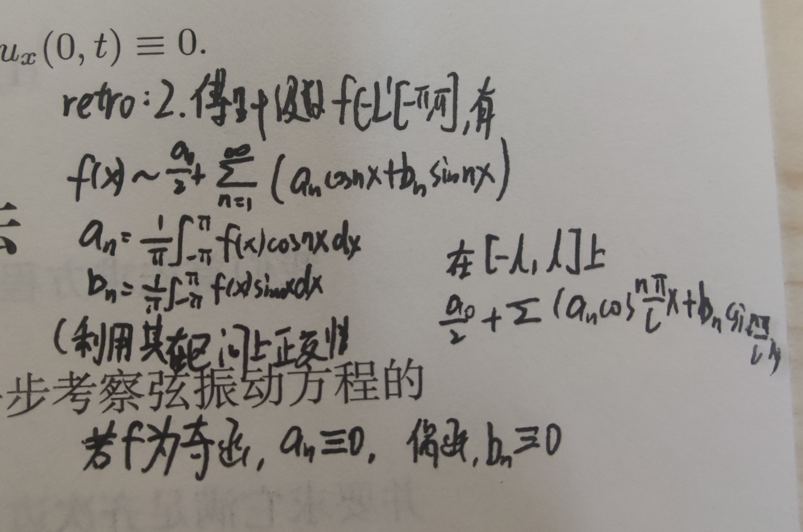
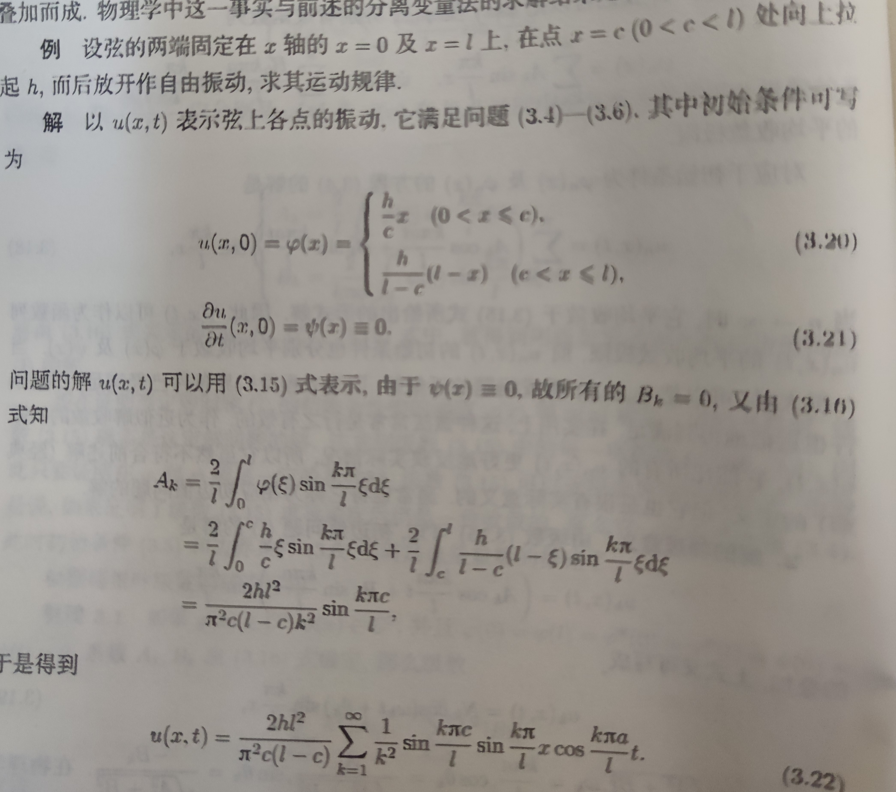

# 复习

1. 对$y''+by'+cy=0 $的通解，使用特征方程法进行求解。
2. 傅里叶级数的一些性质。

**注意对这两项的复习。**

3. 级数的一致收敛

> 如果希望对级数逐项求导，就需要确认级数的一致收敛性。
> 事实上，一致收敛的级数的性质包括：
> 1. 逐项积分
> 2. 逐项求导
> 3. 极限交换
> 4. 级数内部函数连续则级数本身也连续
> 5. 一致有界
>
> 为了证明级数的一致收敛，有多种方法。这里可以使用的是**优级数判别法**：
> $a_k$与$u_k$满足$|u_k|\leq a_k,\forall k\in N $，且$\sum a_k$收敛，那么$\sum u_k$一致收敛

# 边界条件齐次的初边值问题

单纯的达朗贝尔方法是用于解决无界的初值问题，即Cauchy问题。本次的问题涉及到**有界的初边值问题**。

首先考虑边界条件齐次的情况。

$$\begin{equation}
\left\{
    \begin{array}{ll}
        u_{tt}-a^2u_{xx}=f(x,t);t>0, 0<x<l\\
        t=0: u=\phi(x),u_t=\psi(x)\\
        x=0:u=0\\
        x=l:u=0
    \end{array}
\right.
\end{equation}$$

仍然可以利用分离定理来获得两个初边值问题$$\begin{equation}
\left\{
    \begin{array}{ll}
        u_{tt}-a^2u_{xx}=0;t>0, 0<x<l\\
        t=0: u=\phi(x),u_t=\psi(x)\\
        x=0:u=0\\
        x=l:u=0
    \end{array}
\right.
\end{equation}$$$$\begin{equation}
\left\{
    \begin{array}{ll}
        u_{tt}-a^2u_{xx}=f(x,t);t>0, 0<x<l\\
        t=0: u=0,u_t=0\\
        x=0:u=0\\
        x=l:u=0
    \end{array}
\right.
\end{equation}$$

## 对齐次的初边值问题求解

一个复杂的振动往往可以分解为不同频率单音的叠加。每种单音的形式为$$u(x,t)=X(x)T(t) $$

代入齐次方程，有$$X(x)T''(t)-a^2X''(x)T(t)=0 $$，分离变量就有$$\frac{T''(t)}{a^2T(t)}=\frac{X''(x)}{X(x)}=\lambda $$

由此就有$$T''(t)+\lambda a^2T(x)=0\\ X''(x)+\lambda X(x)=0 $$

现在需要寻找解$X$，使得其均不恒为0时，也能满足$$X(0)=0,X(l)=0 $$

容易验证，要使$X$不恒为0，就必须有$\lambda>0$，此时使用特征方程法解方程有$$X(x)=C_1\cos{\sqrt{\lambda}x}+C_2\sin{\sqrt{\lambda}x} $$代入边值条件有$C_1=0$，$\lambda=\frac{k^2\pi^2}{l^2},k=1,2,3,...$，这样就有一族非零解$$X_k(x)=\sin{\frac{k\pi}{l}x} $$

称$X_k(x)$右端函数为满足边界条件的**固有函数(特征函数)** ，$\lambda=\frac{k^2\pi^2}{l^2}$为**固有值(特征值)**。

代入前面的方程还能得到$$T_k(t)=A_k\cos{\frac{k\pi a}{l}t}+B_k\sin{\frac{k\pi a}{l}t} $$为方程$T''(t)+\lambda a^2T(x)=0$的通解。

于是就有了原方程组在不考虑初值条件时的解$$u(x,t)=\sum_{k=1}^\infty (A_k\cos{\frac{k\pi a}{l}t}+B_k\sin{\frac{k\pi a}{l}t})\sin{\frac{k\pi}{l}x} $$，其中$A_k,B_k$是任意常数。

然而为了考虑到初值条件，还需要求出满足的$A_k,B_k$。

对$u$的级数关于$t$逐项求导，就有$$u_t=\sum_{k=1}^{\infty}\frac{k\pi a}{l}(-A_k\sin{\frac{k\pi a}{l}t}++B_k\cos{\frac{k\pi a}{l}t})\sin{\frac{k\pi}{l}x} $$

代入$t=0$时的初始条件就有$$\begin{equation}
\left\{
    \begin{array}{ll}
        \phi(x)=\sum_{k=1}^\infty A_k\sin{\frac{k\pi}{l}x}\\
        \psi(x)=\sum_{k=C_1}^\infty\frac{B_kk\pi a}{l}\sin{\frac{k\pi}{l}x}
    \end{array}
\right.
\end{equation}$$，那么根据傅里叶展开的性质，就有$$\begin{equation}
\left\{
    \begin{array}{ll}
        A_k=\frac{2}{l}\int_0^l\phi(\xi)\sin{\frac{k\pi}{l}\xi}\text{d}\xi\\
        B_k=\frac{2}{k\pi a}\int_0^l\psi(\xi)\sin{\frac{k\pi}{l}\xi}\text{d}\xi
    \end{array}
\right.
\end{equation}$$

此后，可以通过优级数判别法来证明级数求导两次后仍是一致收敛的，那么这个结论就成立。

事实上，只要满足**相容性条件**$$\phi(x)\in C^3,\psi(x)\in C^2, \text{and}\\ \phi(0)=\phi(l)=\phi''(0)=\phi''(l)=\psi(0)=\psi(l)=0 $$，那么级数$$\sum_{k=1}^{\infty}k^2 |A_k|,\sum_{k=1}^\infty k^2|B_k|  $$都收敛。

以上的方法就是**分离变量法**，又叫**傅里叶方法**。

**P26例题需要掌握**

## 初值非齐次方程的情形

$$\begin{equation}
\nonumber
\left\{
    \begin{array}{ll}
        u_{tt}-a^2u_{xx}=f(x,t);t>0, 0<x<l\\
        t=0: u=0,u_t=0\\
        x=0:u=0\\
        x=l:u=0
    \end{array}
\right.
\end{equation}$$

仍然利用齐次化原理，就有$$\begin{equation}
\nonumber
\left\{
    \begin{array}{ll}
        w_{tt}-a^2w_{xx}=0;t>\tau\\
        t=\tau:w=0,w_t=f(x,\tau)\\
        x=0:u=0;t>\tau\\
        x=l:u=0;t>\tau
    \end{array}
\right.
\end{equation}$$，并且$$u(x,t)=\int_0^tw(x,t,\tau) \text{d}\tau$$

于是就可以使用同上的方法解决了。

该问题的相容性条件为$$f(0,t)=f(l,t) $$

# 边界条件非齐次的初边值问题

之前的方法，边界条件是齐次的。现在要考虑边界条件也不齐次的情况。

$$\begin{equation}
\left\{
    \begin{array}{ll}
        u_{tt}-a^2u_{xx}=f(x,t);t>0, 0<x<l\\
        t=0: u=\phi(x),u_t=\psi(x)\\
        x=0:u=\mu_1(t) \\
        x=l:u=\mu_2(t)
    \end{array}
\right.
\end{equation}$$

对这样的问题，也可以作齐次化。令$$U(x,t)=\mu_1(t)+\frac{x}{l}[\mu_2(t)-\mu_1(t)] $$，也就是在$x$轴上的一阶Lagrange插值，也就是在$x=0,l$两点处的函数值连线。再令$$V(x,t)=u-U $$，就可以有一个边值条件齐次的初边值问题了。

$$\begin{equation}
    \left\{
    \begin{array}{ll}
        V_{tt}-a^2V_{xx}=f(x,t)-\mu_1''(t)-\frac{x}{l}[\mu_2''(t)-\mu_1''(t)]\\
        t=0: V=\phi(x)-\mu_1(0)-\frac{x}{l}[\mu_2(0)-\mu_1(0)]\\
        t=0: V_t=\psi(x)-\mu_1'(0)-\frac{x}{l}[\mu_2'(0)-\mu_1(0)]\\
        x=0\ \text{or}\ x=l: V=0,V_t=0
    \end{array}
    \right.
\end{equation}$$，解出来以后有$$u=V+U $$

该问题的相容性条件为$$\phi_1(0)=\phi_1(l)=\phi_1''(0)=\phi_1''(l)=\psi_1(0)=\psi_1(l)=0 $$

