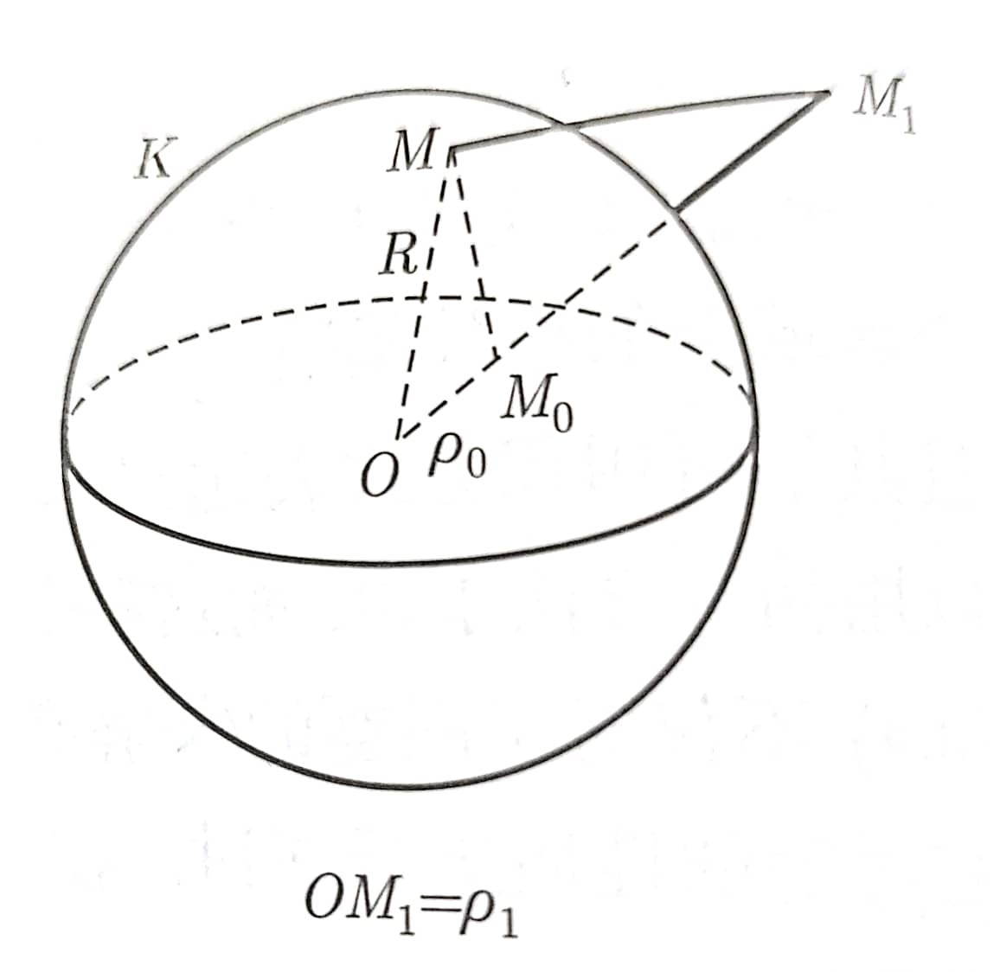

考虑[上一节](./2-格林公式及其应用.md)中提到的求$u$在点$M_0$的式子，已经有$$u(M_0)=-\frac{1}{4\pi}\iint_{\partial \Omega} \big[ u(M)\frac{\partial}{\partial \bm{n}}(\frac{1}{r_{M_0M}})-\frac{1}{r_{M_0M}}\frac{\partial u}{\partial \bm{n}} \big]\text{d}S $$

但是，对于此公式，其同时需要$u$与$\frac{\partial u}{\partial\bm{n}}$在边界的值，这不足以直接用于求解调和方程的Dirichlet与Neumann问题。

本节考虑Dirichlet问题的情景，尝试**消去其中的 $\frac{\partial u}{\partial\bm{n}}$项**。为了达成这一目的，就要引入**格林函数**。

# 格林函数

## 引入

应当考虑到，之前应用的$v=\frac{1}{r_{M_0M}}$本身的要求就是在边界满足$\frac{1}{r_{M_0M}}$的性质。但问题在于，其仅在$M_0$点不解析，当然也不调和。

那么，为什么不直接找一个在$\Omega$内调和的，并且在边界又满足$\frac{1}{r_{M_0M}}$性质的呢？于是就给出下面的问题来定义一个$g$$$ \begin{equation}
    \nonumber
    \left\{
    \begin{split}
        \Delta g(M,M_0)&=0,\quad M\in \Omega\\
        g(M,M_0)|_{M\in\partial\Omega}&=\frac{1}{4\pi r_{M_0M}}
    \end{split}
    \right.
\end{equation} $$

这样，用$g$来代替$v$，考虑Green第二公式$$\int_\Omega[u\Delta v-v\Delta u ]\text{d}x=\int_{\partial \Omega}[u\frac{\partial v}{\partial \bm{n}}-v\frac{\partial u}{\partial \bm{n}}]\text{d}S $$就能得到$$ \int_{\partial \Omega}[u\frac{\partial v}{\partial \bm{n}}-v\frac{\partial u}{\partial \bm{n}}]\text{d}S=0$$而不用挖去任何地方。

用之前的解加上上式，就有$$u(M_0)=\iint_{\partial \Omega}u\frac{\partial(\frac{1}{4\pi r_{M_0M}}-g)}{\bm{n}}\text{d}S $$

现在考虑令$$G=\frac{1}{4\pi r_{M_0M}}-g $$

这个$G$就是**Green函数**，又可称为Dirichlet问题的源函数。

## Green函数的性质

1. $G|_{M\in \partial \Omega}=0 $
2. - $G$在$M=M_0$外所有点处处调和
   - $M\to M_0$时，$G\to\infty$ 且逼近速度与$\frac{1}{4\pi r_{M_0M}}$相同
3. $0<G<\frac{1}{4\pi r},M\neq M_0$ ，并且 $$\begin{equation}
    \nonumber
    \left\{
    \begin{split}
        \Delta G&=0\\
        G|_{\partial \Omega}&=0\\
        G|_{\partial B_{\epsilon}(M_0)}&>0
    \end{split}
    \right.
\end{equation} $$
4. **互易原理：**$G(M_1,M_2)=G(M_2,M_1)$
5. Green函数在边界的积分为-1，即 $$\int_{\partial\Omega}\frac{\partial G}{\partial \bm{n}}\text{d}S=-1 $$

> 下面对性质5进行证明
>
> 证明：
> 首先有$$\int_{\partial\Omega}\frac{\partial G}{\partial \bm{n}}\text{d}S=\int_{\partial\Omega}\big[\frac{\partial(\frac{1}{4\pi r})}{\partial \bm{n}}-\frac{\partial g}{\partial \bm{n}}\big]\text{d}S $$
>
> 考虑散度定理 $$\int_{\partial \Omega}\frac{\partial g}{\partial \bm{n}}\text{d}S= \int_{\partial \Omega}\nabla g\cdot \bm{n}\text{d}S =\int_\Omega \Delta g\text{d}V=0 $$
>
> 再考虑区间$\Omega_\epsilon=\Omega/\overline{B_\epsilon}(M_0) $，然后再一次应用散度定理，有$$\int_{\partial \Omega_\epsilon}\frac{\partial \frac{1}{4\pi r}}{\partial\bm{n}}\text{d}S=\int_{\Omega_\epsilon}\Delta (\frac{1}{4\pi r})\text{d}S=0=\int_{\partial\Omega}\frac{\partial \frac{1}{4\pi r}}{\partial \bm{n}}\text{d}S+\int_{\partial B_\epsilon(M_0)}\frac{\partial \frac{1}{4\pi r}}{\partial \bm{n}}\text{d}S $$
>
> 根据这个就能有$$ \int_{\partial\Omega}\frac{\partial G}{\partial \bm{n}}\text{d}S= -\int_{\partial B_\epsilon(M_0)} \frac{\partial \frac{1}{4\pi r}}{\partial \bm{n}}\text{d}S=-1$$
> 

> Green函数**到底是什么东西**？可以在Dirac δ函数意义下来解释。(这一部分应该不是课程考点)。
> 
> ---
> 
> **Dirac δ函数**可理解为一个在某点处是**某种特定的**无穷大，其余点处为零的广义函数。为了更好地解释，这里给出一维区域的例子。
> 
> 在一维区域，可以举例$$h_n(x)=\begin{equation}
    \nonumber
    \left\{
        \begin{split}
            n&,\quad x\in (-\frac{1}{2n},\frac{1}{2n})\\
            0&,\quad \text{otherwise}
        \end{split}
    \right.
\end{equation} $$，那么在某个意义上的极限$\lim_{n\to\infty}h_n(x) $就是关于$x=0$点的Dirac δ函数。
> 这样得到的Dirac δ函数不仅满足一点无穷，其余点为零的要求，还满足全空间积分为$1$。
>
> 上面的只是一种**解释**，现在给出Dirac δ函数的**定义**。这里给出的是积分意义下的定义。
>
> 对于任意给出的$\Omega$上的在$M_0$处连续的函数$\varphi$，满足$$\int_\Omega \delta_{M_0}(M)\varphi(M)\text{d}V=\varphi(M_0) $$，这样的$\delta_{M_0}$就是Dirac δ函数。
>
> 其实还有一种定义，基于微分意义。$$\delta(x)=H'(x) $$，其中$$H(x)=\begin{equation}
    \nonumber
    \left\{
        \begin{split}
            0,\quad x<0\\
            1,\quad x>0
        \end{split}
    \right.
\end{equation} $$
>
> 总体上，Dirac δ函数可以通过卷积操作来筛选出一个函数在某一点的值。
>
> ---
>
> Dirichlet问题的Green函数，本质上就是构造一个函数$G$满足$$\begin{equation}
    \nonumber
    \left\{
        \begin{split}
            \Delta G(M,M_0)=\delta_{M_0}(M),&\quad M\in \Omega\\
            G(M,M_0)=0,&\quad M\in \partial\Omega
        \end{split}
    \right.
\end{equation} $$
>
> 实际上，更广义的Green函数是针对任意一个一般的线性微分算子$\mathcal{L}$，如果想要求解$$\mathcal{L}[u]=f$$，其中$f$是一个源项，那么就要构造Green函数满足$$\mathcal{L}[G(M,M_0)]=\delta_{M_0}(M) $$，那么解就是$$u(x)=\int G(M,M_0) f(M)\text{d}V $$
> 这个积分是在整个源分布区域进行的。我们可以直观地理解这个公式：
> 源项$f(x)$在每一点$x$的强度乘以该点源在$x$处产生的响应$G(x,x)$，然后对所有可能的源点$x$进行叠加（积分），就得到了总的响应$u(x)$。
>
> 因此，从这个角度来理解，Green函数就是**系统对单位点源的响应**。
>
> ---
>
> 另外，从这个角度可以重新证明性质5
> 证明：
> $$ \int_{\partial\Omega}\frac{\partial G}{\partial \bm{n}}\text{d}S=\int_\Omega\Delta G\text{d}V=-\int_\Omega\delta_{M_0}(M)\text{d}V=-1 $$
> 

# 求出Green函数

现在，只需要求出区域$\Omega$的Green函数即可。主要地，是要求解出$\partial \Omega$上Green函数关于边界法向的导数。

这里运用**镜像法**来求解Green函数。

本身要求解Green函数，只需要求解函数$g$即可。即 $$ \begin{equation}
    \nonumber
    \left\{
    \begin{split}
        \Delta g(M,M_0)&=0,\quad M\in \Omega\\
        g(M,M_0)|_{M\in\partial\Omega}&=\frac{1}{4\pi r_{M_0M}}
    \end{split}
    \right.
\end{equation} $$

## 球上的Green函数

在**无边界**的Laplace方程下，其基本解是已知的。$$\begin{equation}
    \nonumber
    \left\{
        \begin{split}
            \frac{1}{2\pi}\ln{\frac{1}{r}},\quad& n=2 \\
            \frac{1}{n\omega_n} r^{2-n},\quad & n\geq 3
        \end{split}
    \right.
\end{equation} $$，其中，$\omega_n$为$n$维空间中单位球的体积。

现在的目的是，考虑球外存在一点$M_1$，称为**反演点**。希望这个$M_1$处的某个解与$M_0$的基解叠加后，恰好在球上抵消。这种情况是真的可以成立的，这是因为后面可以看到的一对相似三角形出现。

图示球中，$OM_0M_1$共线，$\rho_0=\overline{OM_0},\rho_1=\overline{OM_1}$，$M_0,M_1$在$O$的同侧。$M_0$在球内，$M_1$在球外，$M$为球上任一点。

如果构造$$\frac{\rho_1}{R}=\frac{R}{\rho_0} $$，很容易就能看到$$\triangle OM_0M\sim \triangle OMM_1 $$

现在，直接找一个$M_1$上的径向对称解，形如$$g(M,M_0)=\frac{1}{4\pi}c\frac{1}{r_{MM_1}} $$，其中$c$是某个常数能够使得$$g|_{B_R(O)}=\frac{1}{4\pi r_{M_1M_0}} $$，这个常数$c$将只能取$c=\frac{|MM_1|}{|MM_0|}=\frac{R}{\rho_0}$

现在记$|OM|=\rho,\angle MOM_0=\nu$，这样$$r_{MM_0}=\sqrt{\rho_0^2+\rho^2-2\rho_0 \rho\cos\nu} $$$$r_{MM_1}=\sqrt{\rho_1^2+\rho^2-2\rho_1 \rho\cos\nu}  $$

那么就能有$$ G=\frac{1}{4\pi}\bigg[ \frac{1}{\sqrt{\rho_0^2+\rho^2-2\rho_0 \rho\cos\nu} }-\frac{\rho}{\rho_0}\frac{1}{\sqrt{\rho_1^2+\rho^2-2\rho_1 \rho\cos\nu}} \bigg] $$

关于$\bm{OM}$方向求导，就有$$ \frac{\partial G}{\partial \bm{n}}=\frac{\partial G}{\partial \rho}\bigg|_{\rho=R}=-\frac{1}{4\pi R}\frac{R^2-\rho_0^2 }{(R^2+\rho_0^2-2R\rho_0\cos \nu)^{\frac{3}{2}}} $$

因此，Dirichlet解的表达式为$$ u(M_0)=\frac{1}{4\pi R}\iint_K \frac{R^2-\rho_0^2 }{(R^2+\rho_0^2-2R\rho_0\cos \nu)^{\frac{3}{2}}}f(M)\text{d}S_M $$

这就是**泊松公式**。

> 另外，二维的情况下也是一致的，$$G=\frac{1}{2\pi}\ln{\frac{1}{r_{MM_0}}}-\frac{1}{2\pi} \ln{\frac{c}{r_{MM_1}}},\quad c=\frac{R}{\rho_0} $$

## $R^3_+$上的Green函数

若$u$调和，$u(M)=o(\frac{1}{r_{OM}}),|\nabla u(M)|=O(\frac{1}{r_{OM}^2}) $

类似地，有$$u(M_0)=-\frac{1}{4\pi}\int{\partial R_+^3}\big[ u\frac{\partial \frac{1}{r}}{\partial \bm{n}}-\frac{1}{r}\frac{\partial u}{\partial \bm{n}} \big]\text{d}S=-\int_{\partial R^3_+}u(M\frac{\partial G}{\partial \bm{n}})\text{d}S $$，其中$G=\frac{1}{4\pi r}-g(M,M_0) $

这里，反演点可以直接取$M_0$关于某维取零平面的对称点，即$M_1(x_0,y_0,-z_0)$。此时$r_{MM_1}=r_{MM_0} $，所以$c=1$，就有$g(M,M_0)=\frac{1}{4\pi}\frac{1}{r_{MM_1}} $，据此就有$G$与$\frac{\partial G}{\partial \bm{n}}$了。

